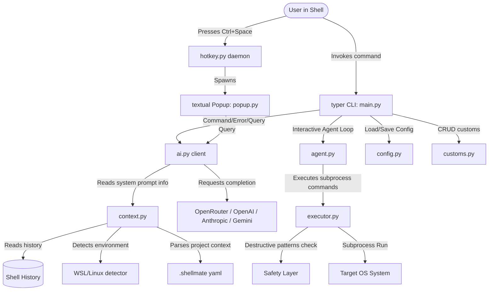

# Core Architecture & System Design

Shellmate is designed as a modular terminal assistant. Below is an overview of the key components and how they interact.

## Component Diagram & Interaction Flow

---

## Component Details

### 1. `shellmate/main.py`
The central command registration module built on `typer`.
- Contains commands: `explain`, `agent`, `setup`, `profile-setup`.
- Hosts nested subcommands: `custom` (add, list, edit, remove), `model` (list, set), `config` (list, set), `project` (add, list).
- Uses `rich` console panels for beautiful visual output.

### 2. `shellmate/core/config.py`
Manages the application state and core settings within `~/.shellmate/config.yaml`.
- Handles profile fields (name, preferred shell, favorite editor, git default branch).
- Manages AI provider authentication (endpoints, API keys, active model selections).
- Transparently merges user configurations with built-in default fallback config maps.

### 3. `shellmate/core/customs.py`
Provides CRUD capabilities for user command macros defined in `~/.shellmate/customs.yaml`.
- Parsed variables are captured from the string using regex matches (`\{(\w+)\}`).
- Automatically prompts users dynamically for parameters before running templates.

### 4. `shellmate/core/context.py`
Gathers local environment details to feed into system prompts for the LLM.
- **Shell History**: Parses history file locations dynamically from the `$SHELL` environment variable (`~/.bash_history`, `~/.zshrc`, `~/.local/share/fish/fish_history`). Cleans up custom metadata tags (like zsh timestamps).
- **OS Detection**: Reads `/proc/version` to determine if running inside a Windows Subsystem for Linux (WSL) setup or native Linux.
- **Project Files**: Detects local `.shellmate` yaml context configurations dynamically within the current working directory.

### 5. `shellmate/core/executor.py`
Encapsulates safe program execution.
- Evaluates statements for known hazardous structures (e.g. `rm -rf`, `chmod 777`, `mkfs`, fork bombs, etc.).
- Halts execution of dangerous calls and prompts for an explicit typing of `YES` before proceeding.
- Returns structured JSON payloads containing `stdout`, `stderr`, and `returncode`.

### 6. `shellmate/core/ai.py`
Client connector translating generic prompts to multiple API specifications.
- Supported interfaces: OpenRouter (completions + json mode), OpenAI (completions + json mode), Anthropic (messages schema), Google Gemini.
- Aggregates configuration details, custom macros, working directories, active shells, and shell history to feed high-fidelity system prompts.
- Catches rate limit errors (`429`) and outputs user-friendly error banners notifying limit thresholds.

### 7. `shellmate/core/agent.py`
Runs the autonomous agentic loop.
- Passes a multi-step objective directly to the planning model (configured with `agent_model` like `deepseek-r1:free`).
- Steps are executed progressively, giving options to:
  - Approve execution (`y`)
  - Skip (`s`)
  - Reject command with prompt adjustment input (`n`)
  - Abort execution completely (`a`)
- In case of failure (non-zero exit code), stdout/stderr feedback is fed back into the conversation context for dynamic model self-correction.

### 8. `shellmate/tui/popup.py`
Uses `textual` to construct a TUI utility overlay window.
- Listens to clipboard commands, automatically copying suggestions on focal key presses.
- Initiates thread-isolated chat queries keeping terminal responsive.

### 9. `shellmate/daemon/hotkey.py`
A light listening service using `pynput` targeting global keyboard hooks (`Ctrl+Space`).
- Spawns the `popup.py` GUI inside target active tty shell inputs.
